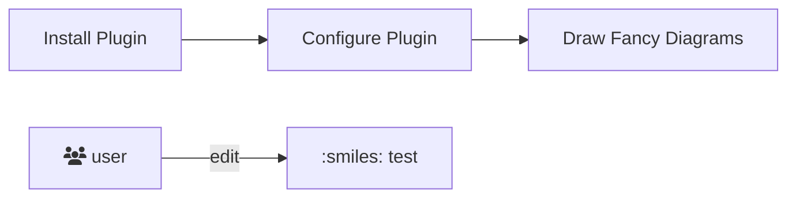
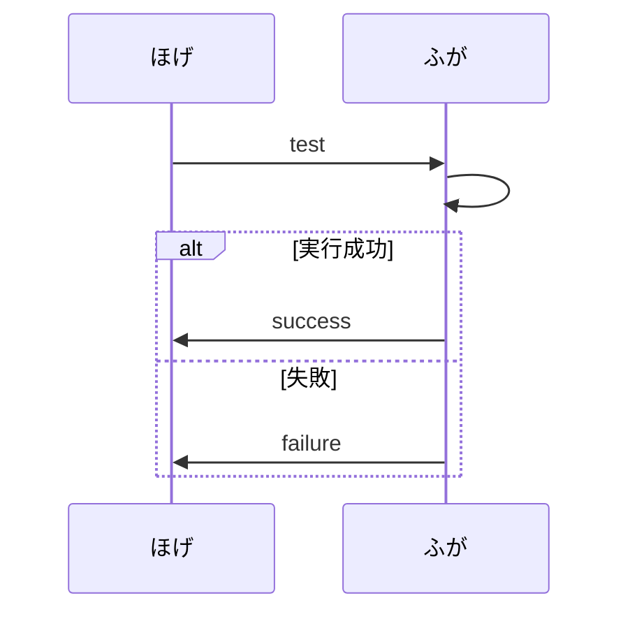

## mermaid.jsのテスト1

```mermaid
graph LR
install[Install Plugin]
install --> configure[Configure Plugin]
configure --> draw[Draw Fancy Diagrams]
user[fas:fa-users user] -- edit --> folder[:smiles: test]
```

## mermaid.jsのテスト2

```mermaid
sequenceDiagram
    ほげ ->> ふが: test
    ふが ->> ふが: 
    alt 実行成功
        ふが ->> ほげ: success
    else 失敗
        ふが ->> ほげ: failure
    end
```
