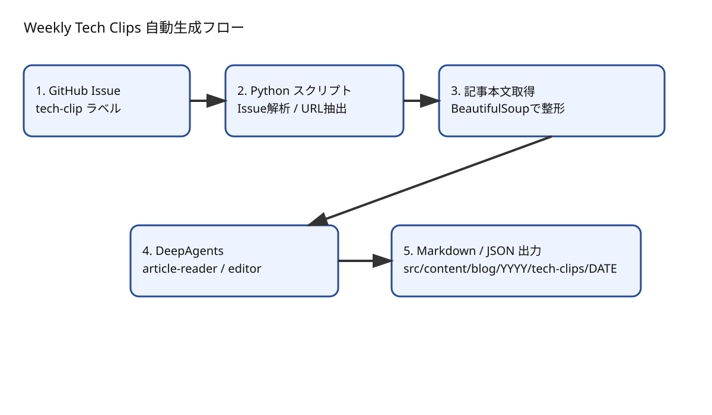
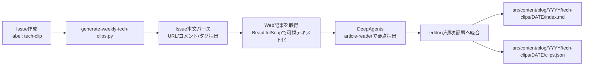

```toc
```

> この記事は、`scripts/generate-weekly-tech-clips.py` の実装と、実際に出力される `index.md / clips.json` を前提に、運用目線で仕組みを整理したものです。



## はじめに

この仕組みの狙いはシンプルです。  
**「その週に読んだ技術記事」を、読み返せる形で短時間に公開すること。**

ただし実装は「AIに丸投げ」ではありません。  
入力の標準化（Issue）→ 前処理（本文抽出）→ 役割分担（reader/editor）→ 出力の二層化（Markdown/JSON）という、地味ですが壊れにくい流れになっています。

## 1. 全体像（どこで品質が決まるか）



品質を左右するのは、実は生成フェーズよりも **前処理** です。

- Issue記法の揺れをどこまで吸収するか
- HTMLから本文をどこまで正しく抜けるか
- モデルに渡す文量をどこで制限するか

この3点が安定すると、最終記事のトーンも安定します。

## 2. 入力: GitHub Issue を「収集フォーマット」にする

対象は `tech-clip` ラベルの Issue。  
スクリプトは GitHub API で一覧を取得し、本文から次の項目を抽出します。

- URL
- コメント（ひとこと）
- 作成日時
- 共有元（source）
- タグ
- 重要度

実装が良いのは、`URL / Url / Link / リンク` のような見出し揺れを許容している点です。現場ではテンプレを守りきれない日が出るので、この吸収層があるだけで運用ストレスが大きく下がります。

## 3. 前処理: 記事本文を「読める入力」にする

IssueからURLを取った後は、ページ本文を取得してノイズを落とします。  
`script/style/noscript/iframe` などを除外し、`article`・`main`・`entry` など本文らしい領域を優先して採用する設計です。

ここでの目的は、要約精度の向上というより **誤読の削減** です。  
メニュー文言・広告・関連記事が混じった入力は、もっともらしいけれど焦点のぼけた文章を生みやすくなります。

## 4. 生成: 読む役（reader）と編集役（editor）を分ける

DeepAgents側では、

- `article-reader`: 各記事から要点を拾う
- `editor`: 週次の流れとして再構成する

という責務分離がされています。

この分離の利点は、最終文体の統一よりも、**失敗箇所の切り分けがしやすい** ことです。

- reader由来のミス: 個別記事の取り違え
- editor由来のミス: 週全体の論点整理不足

問題が起きたときに「どこを直すべきか」が見える設計になっています。

## 5. 長文制御: 入力量を上限で止める

`ARTICLE_TEXT_LIMIT` と `TOTAL_ARTICLE_TEXT_LIMIT` は、コスト最適化だけでなく品質安定にも効いています。

- 1記事が極端に長いときの偏りを防ぐ
- 週全体で入力過多になったときの破綻を防ぐ
- 毎週の出力品質を一定レンジに寄せる

「全部入れる」より「必要十分で止める」ほうが、週次メモの運用では再現性が高くなります。

## 6. 出力: Markdown と JSON を分けて残す意味

最終成果は2ファイルです。

- `index.md`（公開・人間編集向け）
- `clips.json`（構造化・再利用向け）

この二層化は、あとから効いてきます。

- 記事本文だけ手で推敲したいときは `index.md` を編集
- 集計や再分析をしたいときは `clips.json` を利用

公開物と素材を同時に残す、という設計です。

## 7. 品質チェック（実運用で最低限見る項目）

公開前は、次を必ず確認すると安定します。

1. 参照リンクが生きているか（404 / 無限リダイレクトの有無）
2. 各クリップの「ひとこと」の意図が残っているか
3. 見出し順が自然か（単なる箇条書きになっていないか）
4. 「今週の所感」に具体性があるか（差分が読めるか）
5. 言い換え重複や断定口調が過剰でないか

このチェックを入れるだけで、いわゆる生成文っぽさはかなり抑えられます。

## 8. ローカル再生成手順

```sh
uv venv .venv --python 3.12
uv pip install --python .venv/bin/python -r requirements-weekly-tech-clips.txt
GITHUB_TOKEN=... OPENAI_API_KEY=... .venv/bin/python scripts/generate-weekly-tech-clips.py
```

必要なら `OPENAI_WEB_SEARCH=false` を付けて、検索あり/なしの出力差を比較します。  
検証時は、同一入力で2回回して差分を見ると、どの段でぶれているかを把握しやすいです。

## まとめ

この仕組みの本質は、AIの性能競争ではなく、**編集可能なパイプライン設計** にあります。

- 収集をIssueで標準化
- 前処理で入力ノイズを削減
- reader/editorで責務分離
- Markdown/JSONで公開と再利用を分離

この4点があるから、週次運用で「速いのに雑になりにくい」状態を維持できます。
