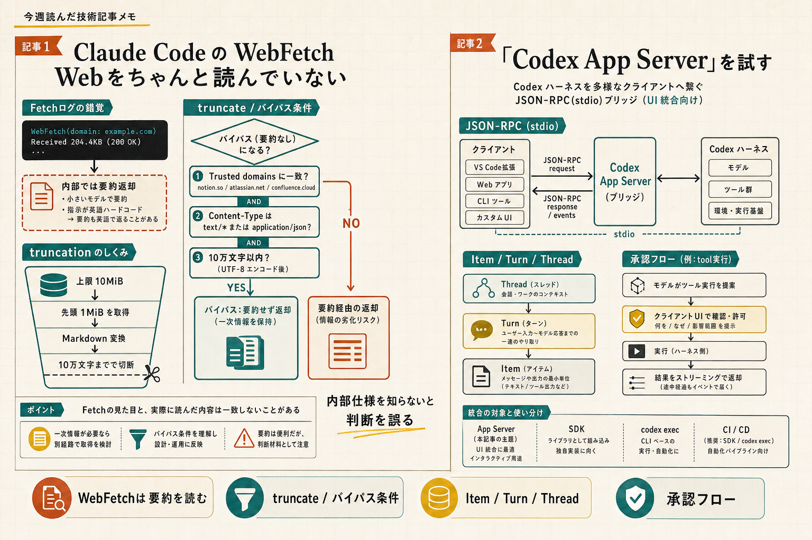

```toc
```



今週は、Claude Code の WebFetch が「読んでいるように見えて実は要約を読んでいる」話と、Codex の App Server をどう使い分けるかの話が並んでいました。どちらも、AI ツールを使う側が内部の構造を知らないと判断を誤りやすい、という点が印象に残りました。

## WebFetch は原文を読んでいるとは限らない

元記事: https://zenn.dev/zhizhiarv/articles/claude-code-webfetch-haiku-summary

### ひとこと
Claude Code の WebFetch は、長いページだと原文そのものではなく、先に小さいモデルで要約された結果を読んでいることがある、という指摘でした。  
`Received 204.4KB` と見えても、その分量をそのまま上位モデルが見ているとは限らないのは、かなり気になりました。

### 読んで考えたこと
実装や運用では、「取得できたサイズ」と「実際に読めた内容」を分けて考えないと危ないです。  
ドキュメントや仕様をAIに読ませるとき、全文を前提に判断しているつもりでも、途中で切れていたり、要約でニュアンスが変わっていたりします。

特に気になったのは次の点でした。

- 長文は途中で truncate されることがある
- 信頼ドメインや Markdown 対応のときだけ挙動が変わる
- 小さいモデルの要約を経由するので、情報が落ちる可能性がある
- Prompt Injection 対策やコスト最適化としては合理性がある

なので、重要な一次情報は WebFetch まかせにせず、`curl` や `defuddle`、専用 MCP で原文を取りにいく運用のほうが安全だと思いました。  
「AI が読んだ」ではなく「どの経路で何を読んだか」を確認する癖が必要です。

## Codex App Server は UI 統合向けだった

元記事: https://zenn.dev/kun432/scraps/9fe862943fb00e

### ひとこと
Codex にはいくつか使い方があるけれど、App Server は「自分でクライアントや UI を作るための窓口」という整理がわかりやすかったです。  
個人用アプリで ChatGPT サブスクの範囲を活かしながら使える、という見方も納得感がありました。

### 読んで考えたこと
この記事を読んで、Codex を「API で呼ぶもの」とだけ見ると少し狭いと思いました。  
App Server は、会話履歴、承認、ストリーミング、認証まで含めて、Codex のハーネスをそのまま使う発想に近いです。

実装の観点では、用途で分けるのが大事そうでした。

- UI を作るなら App Server
- 自動化や CI/CD なら SDK / codex exec / GitHub Action
- 個人用途で ChatGPT アカウントに紐づけたいなら App Server が合う
- 公開サービスのバックエンドにそのまま載せる用途は慎重に見る必要がある

特に運用面では、App Server は便利でも、JSON-RPC や状態管理、認証の扱いを自前で持つ必要があります。  
「ハーネスそのまま」という言葉は魅力的ですが、裏を返すと UI 側の設計責任も増えます。  
まずは個人用や社内用の閉じた範囲で試すのが現実的だと思いました。

## 今週の所感

今回の2本は、どちらも「AI ツールの中で何が起きているかを見ないと危ない」という話でした。  
WebFetch は原文を読んでいる前提を疑う、Codex App Server はどの層を自前で持つかを切り分ける。  
次は、実際に自分の運用でも「要約経由で困る場面」と「App Server を選ぶ場面」を一度棚卸ししてみたいです。

---

## 参照したクリップ

- [あなたのClaude CodeのWebFetch、実はWebをちゃんと読んでいない](https://zenn.dev/zhizhiarv/articles/claude-code-webfetch-haiku-summary)
- [「Codex App Server」を試す](https://zenn.dev/kun432/scraps/9fe862943fb00e)
