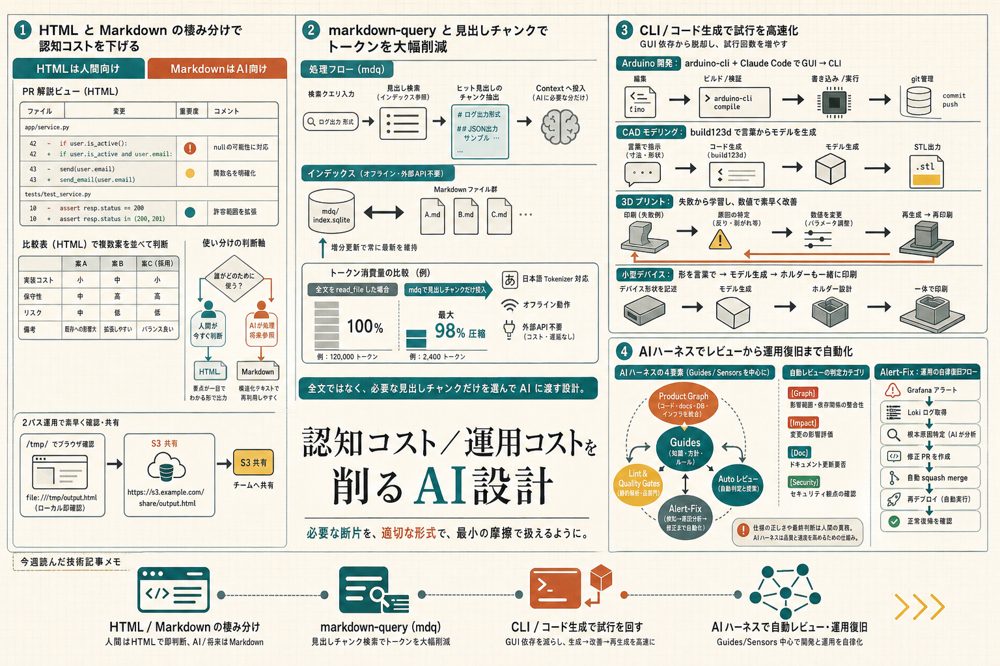

```toc
```



今週は、Markdown と HTML の使い分け、Markdown 検索のトークン節約、Claude Code を使った電子工作、AIハーネスでの自動レビュー・自動修復という並びでした。どれも「AIを使うと速くなる」ではなく、どこで認知コストや運用コストを下げるかに寄っていて、実務寄りで読めました。

## 人間向けの出力はHTMLに寄せる

**元記事**  
[「ClaudeにHTMLで出力してもらう」をやってみたら、Markdownとの棲み分けが見えてきた - サーバーワークスエンジニアブログ](https://blog.serverworks.co.jp/claude-html-vs-markdown)

**ひとこと**  
AIの出力を人間向けに読むとき、HTMLにすると把握しやすいという話でした。自分のコメントにあった「認知負荷が下がる」という感覚が、そのまま整理されていました。

**読んで考えたこと**  
この記事でよかったのは、HTMLを「なんでも置き換えるもの」にしていないところでした。  
PRの説明、複数案の比較、レポート共有みたいに、人が今すぐ判断したい場面ではHTMLに寄せる。一方で、README や CLAUDE.md みたいに Git 管理するもの、AI が読む前提のものは Markdown に残す、という切り分けが現実的でした。

実装面では、HTML を `/tmp/` に出してブラウザで見るか、S3 に置いて URL で共有する運用がそのまま使えそうでした。  
一方で、HTML はトークン量が増えやすいし、Git diff も読みにくいので、保存して後で読む用途には向きにくいです。  
「人間が読む瞬間だけ HTML」にすると、運用の手間と効果のバランスがよさそうだと思いました。

## Markdownを読むコストを減らす

**元記事**  
[Vibe Coding のトークン消費量の40-60%を占めることもある、Markdownファイルの読み込みトークン消費量を最大98%以上圧縮する markdown-query スキル - Qiita](https://qiita.com/dahatake/items/ce9917268d8d18aa9b6c)

**ひとこと**  
Markdown が増えすぎた現場で、全文読込をやめて必要な見出しだけ渡すための仕組みでした。GitHub Copilot や Claude Code の課金がトークンベースに寄るなら、かなり実用的な方向だと感じました。

**読んで考えたこと**  
この話は、単に検索を速くするというより、コンテキスト窓の使い方を整理する話でした。  
全文を `read_file` で入れると、会話履歴やログも合わせてすぐ圧迫されるので、Markdown 群を丸ごと読むやり方は長いセッションだときついです。そこで `mdq` で見出し単位のチャンクだけ返す、というのはかなり筋がいいです。

特に、完全オフラインで動くことと、日本語 tokenizer に対応していることは、社内文書を扱うときに大きいです。埋め込みや外部ベクトルDBを使わないので、閉じたリポジトリでも持ち込みやすいです。  
一方で、grep モードは表記揺れに弱いので、削減率だけ見ずに coverage も見る必要がある、という注意もちゃんと書かれていました。ここは運用上かなり大事で、速いけれど見落とす検索にならないようにしたいです。

自分のメモとしては、Markdown を増やす前提のチームほど、全文読込ではなく「どの断片を AI に渡すか」を設計したほうが効きそうです。

## 電子工作もClaude Codeで回す

**元記事**  
[積みデバイスをClaude Codeで成仏させた春](https://zenn.dev/optimisuke/articles/c9a2e4f7b831d5)

**ひとこと**  
Arduino、CAD、3Dプリンタみたいな「やりたいけど面倒で止まる」領域に、Claude Code を入れて摩擦を下げた話でした。趣味寄りですが、実装の手順が具体的で面白かったです。

**読んで考えたこと**  
印象に残ったのは、ハード系のつまずきが「難しい」より「管理しづらい」「直しづらい」にある、という見立てでした。  
Arduino は `arduino-cli` を使って CLI 化すると、コードを普通に git 管理できるようになる。CAD は `build123d` のような Python ベースのライブラリに寄せると、形を言葉で説明してコード生成できる。3Dプリンタは、失敗しても数値を少し変えてすぐ再試行できると続けやすい、という流れでした。

運用面では、GUI 前提のワークフローを CLI とコードに寄せるのがポイントでした。  
「書き込む」「再生成する」「再印刷する」が毎回同じ手順で回るので、積みっぱなしになりにくいです。  
自分も、何か積んでいるデバイスがあるなら、まずは操作を CLI 化できないかを見るのが先だと思いました。AI はアイデア出しより、こういう反復の壁を崩すのに向いていそうです。

## AIハーネスを整えると運用が回り出す

**元記事**  
[AIのハーネスを徹底的に整えたら、レビューもシステム運用も自動化され、非エンジニアも開発に参加できるようになった話 ── 連載総論](https://zenn.dev/aircloset/articles/d416342f46f16b)

**ひとこと**  
「AIを使う」より「AIが外さないレールを作る」方が本質、という話でした。自動レビュー、自動修正、自動マージ、自動障害修復までつながっていて、かなり強い設計だと思いました。

**読んで考えたこと**  
この記事は、AI の能力そのものより、周辺のハーネスで差がつくという整理が明確でした。  
Product Graph でコード・docs・DB・インフラをつなぎ、lint や coverage で逸脱を潰し、AI レビューで修正まで回し、障害対応も同じ流れに戻す。こうしておくと、非エンジニアが PR を出しても、最終的に品質基準を満たすところまで持っていけるという構成でした。

実装の観点では、フル TypeScript のモノレポに寄せているのが効いていました。  
言語境界をまたがないので、静的解析と自動修正を一気通貫でかけやすいです。  
ただし、ここまで自動化できるのは社内基盤だからこそで、外部向けプロダクトにそのまま持っていくのは難しそうです。仕様の正しさまでは AI が保証できない、という点もちゃんと線引きされていました。

自分としては、AI に任せる範囲を広げるほど、先に「守るべきルール」を減らすのでなく固める必要がある、というのが一番の学びでした。

## 今週の所感

今週は、AI を「文章生成」や「コード生成」だけで見ずに、認知コストと運用コストをどこで下げるかとして扱う記事が多かったです。  
次は、HTML で一度出力してから Markdown に戻す運用、Markdown の検索圧縮、CLI 化できるハード操作、AI ハーネスの品質ゲートあたりを自分の作業でも試してみたいです。

---

## 参照したクリップ

- [「ClaudeにHTMLで出力してもらう」をやってみたら、Markdownとの棲み分けが見えてきた - サーバーワークスエンジニアブログ](https://blog.serverworks.co.jp/claude-html-vs-markdown)
- [Vibe Coding のトークン消費量の40-60%を占めることもある、Markdownファイルの読み込みトークン消費量を最大98%以上圧縮する markdown-query スキル - Qiita](https://qiita.com/dahatake/items/ce9917268d8d18aa9b6c)
- [積みデバイスをClaude Codeで成仏させた春](https://zenn.dev/optimisuke/articles/c9a2e4f7b831d5)
- [AIのハーネスを徹底的に整えたら、レビューもシステム運用も自動化され、非エンジニアも開発に参加できるようになった話 ── 連載総論](https://zenn.dev/aircloset/articles/d416342f46f16b)
