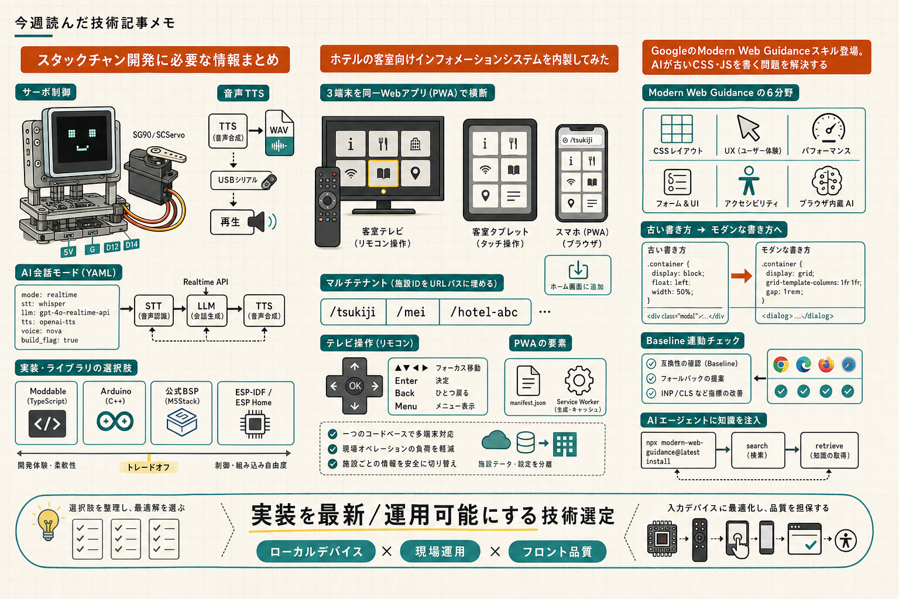

```toc
```



最近のWeb実装や現場寄りの開発メモをまとめて読んでいると、単に「新しい技術を知る」だけでは足りなくて、運用や導入のしやすさまで含めて見ないと判断しづらいものが多いです。今回は、スタックチャン、ホテル客室向けHIS、Modern Web Guidance の3本を、実装の選び方と運用の考え方が見える形で整理しました。

## スタックチャン開発の入口をどう選ぶか

### 元記事
[スタックチャン開発に必要な情報まとめ](https://zenn.dev/karaage0703/articles/f14b27ccb22737)

### ひとこと
スタックチャン周りは、公式系・派生系・自作がかなり広く並んでいて、最初に全体像を掴むのが大変そうだと感じました。

### 読んで考えたこと
記事では、まず「顔の描画」「サーボ制御」「Wi-Fi」「音声合成」「対話エンジン」を分けて見ていて、どこを既製品に寄せるかで選択肢が変わる整理が分かりやすかったです。

特に気になったのは、公式系でも単純に一つではなくて、

- Moddable + TypeScript の本家
- Arduino ライブラリ
- M5Stack 公式の総合プロジェクト
- BSP

のように役割が分かれていた点です。  
「まず動かしたい人」と「自分で組みたい人」で入口がかなり違うので、読んでいて導入の失敗ポイントも見えました。

運用面では、M5Stack 公式系のライセンスが SCServo_lib から FTServo_Arduino に置き換わった話が重要でした。サーボまわりは機能だけでなく、配布時のライセンス整理がそのまま実務に響くので、ここを記事内で押さえているのはありがたかったです。

自作の xangi-stackchan については、PC 側で AI 対話と TTS を持ち、M5 側は再生や表情、移動を担当する割り切りが面白かったです。全部をデバイス側に載せないので、実装の重さと保守のしやすさを両立しやすそうだと思いました。

---

## 客室案内をWebアプリで内製する理由

### 元記事
[ホテルの客室向けインフォメーションシステムを内製してみた](https://zenn.dev/7garden/articles/90bfc4e12b5461)

### ひとこと
これは「便利なWebアプリを作った」という話より、ホテル運用そのものを改善するためのシステム設計として読んだほうがしっくりきました。

### 読んで考えたこと
背景の説明がかなり実務的で、客室で自己解決できない情報をフロントに聞きに来る負荷、紙案内の更新コスト、多言語対応の重さが、そのままシステム化の動機になっていました。  
単純にUIをよくするだけではなく、スタッフの案内工数を減らすことまで目的に入っているのがポイントでした。

構成で面白かったのは、テレビ・タブレット・スマホの3端末を同じWebアプリで横断していたことです。ネイティブアプリを端末ごとに分けるより、1コードベースで管理したほうが更新と運用がかなり楽そうです。

実装面では、

- Next.js App Router
- TypeScript
- Tailwind CSS
- Serwist
- GA4
- Vercel

という構成で、PWA化まで含めて配信のしやすさを重視していました。  
施設ごとにURLパスを分けるマルチテナント構成も、ホテルごとに案内の優先順位が違うことを前提にしていて納得感がありました。

テレビ操作のために、リモコンの方向キーや戻る操作を独自フックで吸収していたのも実装として参考になりました。Webをそのまま置くだけではなく、入力デバイスに合わせて操作層を作り直しているのが現場向きだと思いました。

MDMでタブレットを管理したり、今後ヘッドレスCMSにつなぐ予定がある点も含めて、これは「案内ページ」ではなく「客室オペレーションの基盤」なんだなと感じました。

---

## AIに最新Webの作法を覚えさせる

### 元記事
[GoogleのModern Web Guidanceスキル登場。AIが古いCSS・JSを書く問題を解決する](https://zenn.dev/ubie_dev/articles/modern-web-guidance)

### ひとこと
AIにフロントを書かせると、古い書き方やアクセシビリティ漏れが混ざる問題に対して、かなり実用的な対策だと思いました。

### 読んで考えたこと
記事の主張はかなり明快で、AIが古いCSSやJSを書きがちなのは学習データにレガシー実装が多いから、という整理でした。  
そこで Google 公式の Modern Web Guidance を使って、AIエージェントに最新のWeb機能や考え方を注入する、という流れです。

気になったのは、対象範囲が広いことです。

- CSSレイアウト
- UX
- パフォーマンス
- フォーム / UI
- アクセシビリティ
- ブラウザ内蔵AI

までまとまっていて、単に「新しいAPI一覧」ではなく、実際の実装判断に使える構成でした。  
Baseline に連動しているので、対応状況が揃っていない機能にはフォールバックを添えて提案してくれるのも、実運用ではかなり大きいです。

導入が `npx modern-web-guidance@latest install` で済むのも試しやすい点でした。  
`search` から `retrieve` でガイドを引く流れも、AIに指示を出すときの補助線としてちょうどよさそうです。

筆者が自分のポートフォリオに当てた結果、すでに採用済みの機能だけでなく、テーマ切り替え時のちらつきや日本語フォントの調整みたいな、手を入れる余地まで具体的に出てきたのが印象に残りました。  
「モダンな機能を知っている」だけではなく、「AIにちゃんと使わせる」ための道具として見ると価値が高いと思いました。

## 今週の所感
今週は、技術そのものよりも「どう運用に落とすか」が強く出ている記事が多かったです。  
スタックチャンは構成の選び方、ホテルHISは現場運用との接続、Modern Web Guidance はAIへの知識注入が肝でした。次に試すなら、まずは自分の実装に対して「AIに古い書き方をさせない仕組み」が入れられるか見てみたいです。

---

## 参照したクリップ

- [スタックチャン開発に必要な情報まとめ](https://zenn.dev/karaage0703/articles/f14b27ccb22737)
- [ホテルの客室向けインフォメーションシステムを内製してみた](https://zenn.dev/7garden/articles/90bfc4e12b5461)
- [GoogleのModern Web Guidanceスキル登場。AIが古いCSS・JSを書く問題を解決する](https://zenn.dev/ubie_dev/articles/modern-web-guidance)
