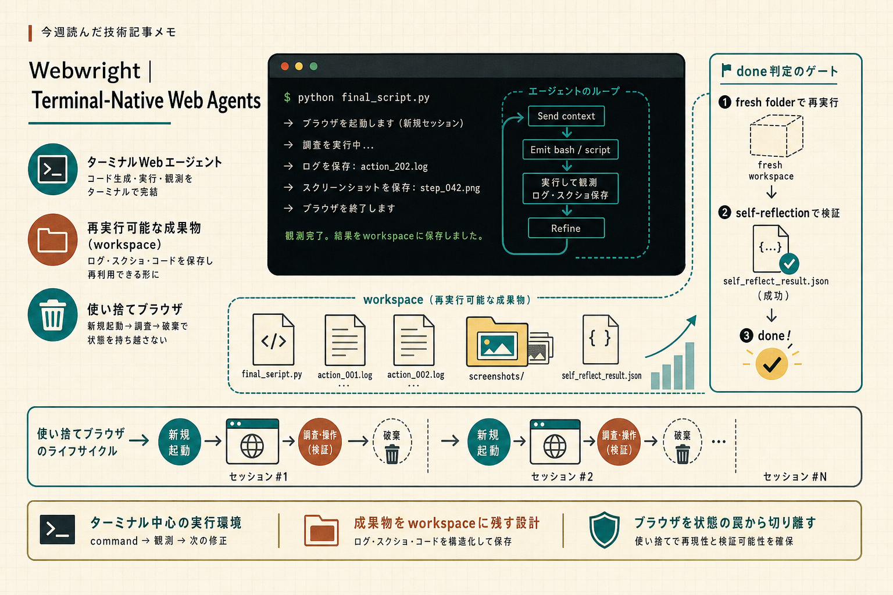

```toc
```



今週は、LLM 用のブラウザ操作や web agent の作り方に関する話がまとまっていて、特に「操作そのもの」より「あとで再利用できる形に残す」設計が気になりました。Playwright をそのまま使う発想に近いけれど、Webwright はもう少し上のレイヤーで、探索・検証・再実行まで含めて扱っているのが印象に残りました。

## ターミナル中心の web agent に寄せる

### 元記事
[Webwright | Terminal-Native Web Agents](https://microsoft.github.io/Webwright/)

### ひとこと
ブラウザを1回きりの操作対象として扱うのではなく、ターミナル・workspace・コードを中心に置いて web agent を組む、という切り替え方が面白かったです。

### 読んで考えたこと
Webwright は、従来の「状態を持ったブラウザを追いかける」形から少し外れていて、AI が terminal 上で Playwright ベースの探索コードを書き、ログやスクリーンショット、最終成果物を workspace に残す設計でした。  
ここでのポイントは、ブラウザ操作の結果が単なる画面遷移ではなく、再利用できるプログラムになることだと思いました。

実装・運用で気になった点は次のあたりです。

- 構成が Runner / Model Endpoint / terminal Environment の3モジュールで比較的小さい
- done 判定の前に、final script を fresh folder で再実行している
- self_reflection を通してから完了扱いにしている
- 長いタスクは context compaction しつつ、実体は workspace に残している

このあたりは、e2e テストにもそのまま効きそうでした。  
特に、探索手順をスクリプト化して残せるなら、失敗時の再現や回帰テストの自動化に向いています。Playwright との差でいうと、単に API を叩いてテストを書くより、AI が「試して、壊して、直して、最後に再実行する」流れを回しやすいのが強みになりそうです。

ただ、運用面では「どこまでを自動化し、どこで人間が確認するか」はまだ難しそうです。  
terminal で自由度を上げるぶん、失敗の種類も増えるので、完了条件を厳しめに設けているのは納得感がありました。

---

## 今週の所感
Webwright は、ブラウザ自動化ツールというより「探索結果を再利用可能な形で残す web agent の枠組み」として見たほうが理解しやすかったです。次に試すなら、Playwright の既存 e2e にこの発想をどう混ぜるか、特にスクリプト再実行と artifact 保存をどこまで標準化できるかを見てみたいです。

---

## 参照したクリップ

- [Webwright | Terminal-Native Web Agents](https://microsoft.github.io/Webwright/)
