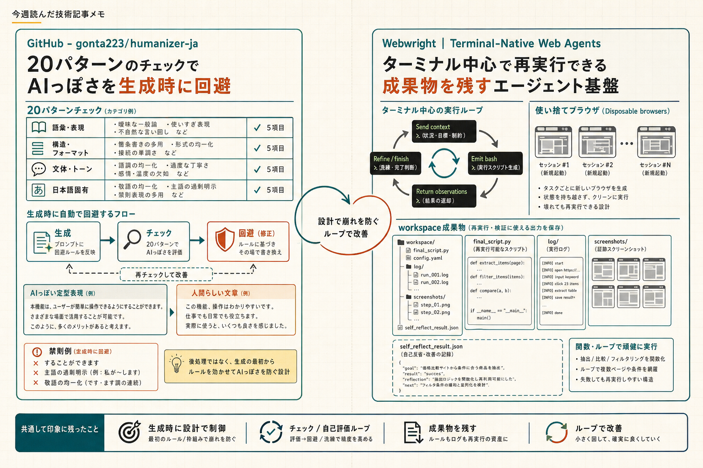

```toc
```



今回は、AIっぽい日本語を整える話と、LLM向けのブラウザ操作をどう設計するかの話を並べて読んでいました。どちらも「生成したあとに直す」より「最初の設計をどうするか」に寄っていて、実装の置き方を考える材料になりました。

## 日本語の“AIっぽさ”を先に潰す

### 元記事
[GitHub - gonta223/humanizer-ja: AIくさい日本語を人間が書いた文章に変換するClaude Codeスキル。20パターンのチェックリスト+書き換えガイド。](https://github.com/gonta223/humanizer-ja)

### ひとこと
Claude Code向けに、日本語の機械っぽさを減らすためのスキルでした。後処理の整形というより、生成の時点で避ける設計にしているのが気になりました。

### 読んで考えたこと
この手のツールは、文章を「直す」より「崩れやすい表現を最初から出さない」ほうが運用しやすいことがあります。特に自動記事作成だと、あとから人手で一律に直すより、生成側にチェックリストを持たせたほうがパイプラインに乗せやすそうでした。

ただ、チェックリスト中心なので、効果はプロンプトやモデルの癖にかなり依存しそうです。日本語特化で「することができます」や主語の過剰明示まで見ているのは実用的で、英語圏のhumanizerよりそのまま使いやすそうに見えました。自動記事生成に入れるなら、テンプレートの文体とぶつからないかは先に確認したいです。

## Webwright は Playwright の置き換えというより、LLM用の実行基盤に近い

### 元記事
[Webwright | Terminal-Native Web Agents](https://microsoft.github.io/Webwright/)

### ひとこと
LLMにブラウザを触らせる話ですが、単に「クリックを自動化する新しい道具」というより、コードと成果物を残すための枠組みとして読めました。

### 読んで考えたこと
Webwright は、ブラウザを一回きりのセッションとして扱うのではなく、ターミナルとローカル workspace を中心に据えているのが特徴でした。実行結果として残るのが操作列ではなく、再利用できるスクリプトやログ、スクリーンショットなのは、あとで検証しやすくてよさそうです。

Playwright と比べると、UI 操作の代替というより、Playwright を使うコードを LLM に生成させて、それを検証・再実行・再利用するための層が足された印象でした。e2e テストにも使えそうですが、このページだけを見る限りでは、テストフレームワークとしての安定運用まで踏み込んだ話ではなく、長い web タスクやエージェント用途が中心でした。

実装が Runner / Model Endpoint / terminal Environment の3モジュールで約1K行というのも、運用する側には分かりやすいです。複雑なオーケストレーションを足しすぎず、失敗時のログや再実行手順を workspace に残す設計は、長いタスクで後追いしやすいと思いました。e2e テストに転用するなら、まずは「最後まで再現できるか」と「失敗時に何が残るか」を見たいです。

## 今週の所感
自動記事作成の品質を上げるなら、生成後の校正より、生成時点で文体を制御するほうが手戻りが少なそうでした。ブラウザ操作も同じで、単発の自動化より、再実行できる形でログと成果物を残す設計を先に考えたほうが使い回しやすそうです。

---

## 参照したクリップ

- [GitHub - gonta223/humanizer-ja: AIくさい日本語を人間が書いた文章に変換するClaude Codeスキル。20パターンのチェックリスト+書き換えガイド。](https://github.com/gonta223/humanizer-ja)
- [Webwright | Terminal-Native Web Agents](https://microsoft.github.io/Webwright/)
