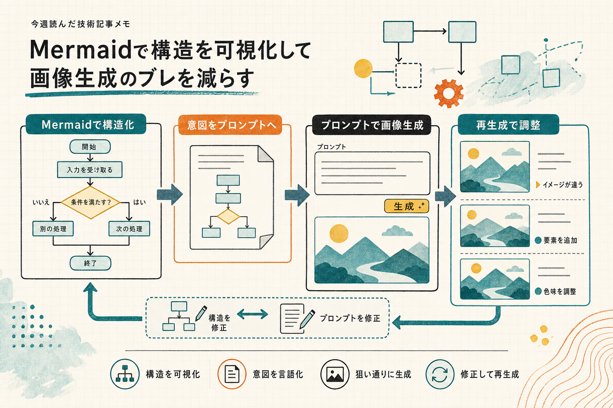

```toc
```



今週は1件だけでしたが、画像生成の前段で Mermaid を挟む発想が気になりました。本文は取得できなかったので、今回は付帯コメントを中心にまとめます。

## 画像生成の前に Mermaid を挟む

**元記事**  
https://qiita.com/ktdatascience/items/4b35eb4e157becfac073

**ひとこと**  
画像生成の前に一度 Mermaid で構造を起こすと、意図が伝わりやすいというメモでした。  
今回は本文が 403 で取れなかったので、記事内容そのものは追えていません。

**読んで考えたこと**  
Mermaid を先に置く運用は、いきなり完成画像を作らせるよりも、こちらの意図を分解して渡しやすいのが利点だと思いました。  
実装や運用の面では、次の流れにするとブレが減りそうです。

- まず Mermaid で構成を確認する
- その図をもとに画像生成のプロンプトを書く
- 必要なら Mermaid 側を修正してから再生成する

この順番にすると、画像生成で起きがちな「見た目はそれっぽいけど構造が違う」を減らしやすいです。  
プロンプト作成の補助としても使えそうで、特にフロー図・シーケンス図・画面遷移みたいな、意味の順序が大事なものと相性がよさそうです。  
一方で、Mermaid を挟むぶん手数は増えるので、雑に1枚出したいだけのケースでは少し重いかもしれません。

**今週の所感**  
画像生成をそのまま投げるより、先に構造を Mermaid で固定する方が安定しそうでした。次に試すなら、図→画像の2段階でどこまで意図のズレが減るかを見たいです。

---

## 参照したクリップ

- [https://qiita.com/ktdatascience/items/4b35eb4e157becfac073](https://qiita.com/ktdatascience/items/4b35eb4e157becfac073)
