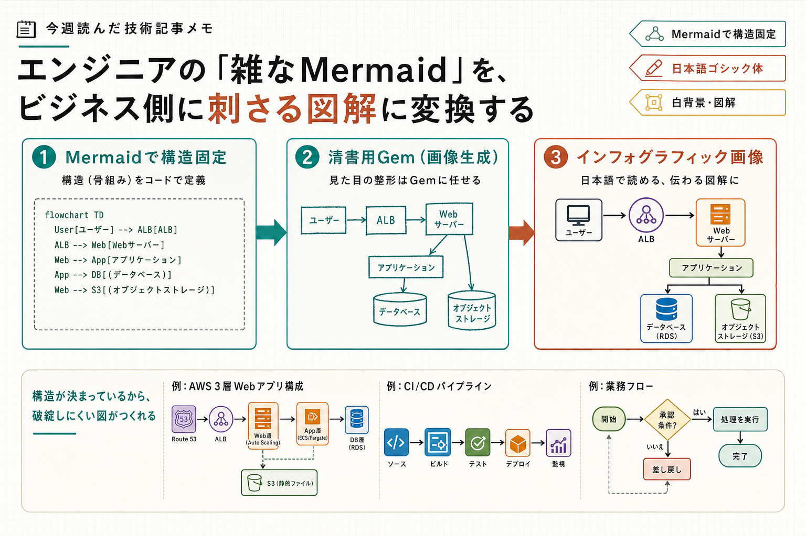

```toc
```



今週は、図を「いきなり清書」するより、まず構造を固定してからAIに整えさせるやり方が印象に残りました。Mermaidを中間表現にすると、エンジニア側の意図を崩さずに資料向けへ寄せやすくなりそうでした。

## Mermaidを先に挟んで図解を崩さない

**元記事**  
[【図解】エンジニアの「雑なMermaid」を、ビジネス側に刺さる図解に変換する - Qiita](https://qiita.com/ktdatascience/items/4b35eb4e157becfac073)

**ひとこと**  
Mermaidで骨組みを固定してから画像生成に渡す、という分担の切り方がわかりやすかったです。

**読んで考えたこと**  
長い説明文をそのまま画像生成に投げると、要素の取捨選択がモデル任せになって崩れやすいので、先にMermaidで関係を確定しておくのは実務で効きそうでした。  
このやり方だと、人間が責任を持つのは構造までで、あとは清書だけをAIに任せられます。資料作成で地味に時間を取られるのは「描けるけど、見せる形にするのが面倒」という部分なので、そこを切り出す発想はかなり実用的でした。  
一方で、記事でも触れていた通り、公式アイコンの再現や日本語の文字品質はモデル依存が強そうでした。対外資料なら、生成結果をそのまま使うより、最後は人間が微調整する前提で見ておくのがよさそうです。ノード数が多い図は、最初から分割して投げる運用のほうが安全だと思いました。

## 今週の所感

Mermaidを「図の下書き」ではなく「AIに渡す構造定義」として使うと、図解の手戻りが減りそうでした。次は、社内資料でどこまで自動化しても崩れないか、モデル選定と分割単位を少し試してみたいです。

---

## 参照したクリップ

- [【図解】エンジニアの「雑なMermaid」を、ビジネス側に刺さる図解に変換する - Qiita](https://qiita.com/ktdatascience/items/4b35eb4e157becfac073)
