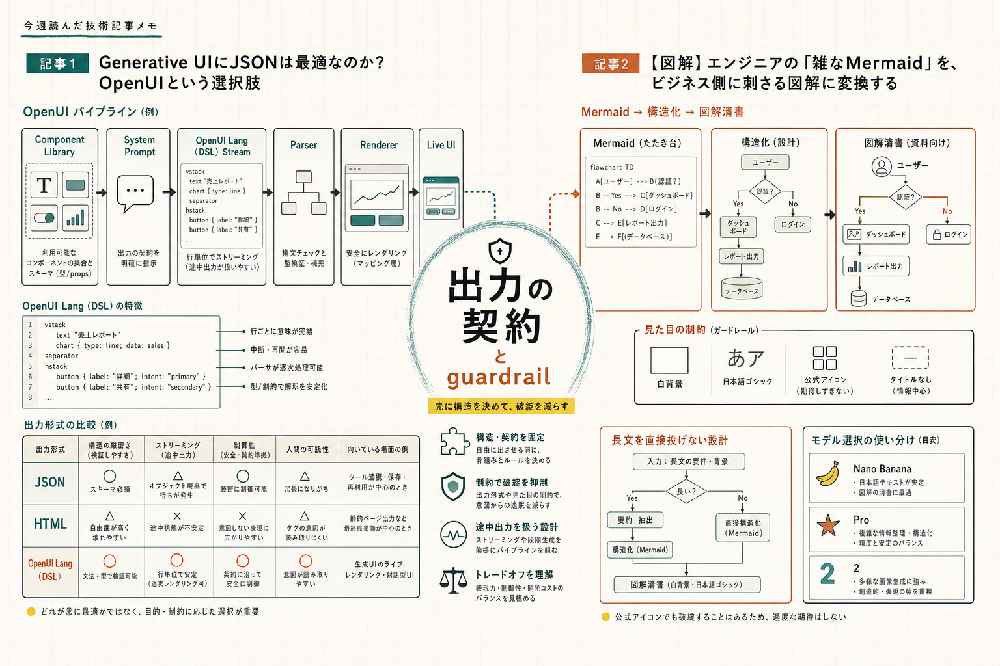

```toc
```



今週は、生成AIまわりでも「何を作れるか」より「どう壊れずに渡せるか」と「どう人間の意図を先に固定するか」が気になりました。OpenUI の記事と、Mermaid を挟んで図解を清書する記事が、ちょうどその2方向を見せていたのでまとめておきます。

## OpenUI の DSL で Generative UI をどう縛るか

### 元記事
[Generative UIにJSONは最適なのか？ OpenUIという選択肢](https://zenn.dev/sc30gsw/articles/d7320f1247b785)

### ひとこと
DSLでUIを作る話として読めました。  
「学習しないしハルシネーション心配？」という感覚も、かなりそのままの論点でした。

### 読んで考えたこと
この記事で一番印象に残ったのは、Generative UI の難しさが「UI を生成すること」ではなく、「AI の出力を安全にレンダリングできる契約を作ること」に寄っている点でした。  
JSON / HTML / DSL の比較は形式の話に見えますが、実際にはどこまで自由度を渡すかの設計でした。

OpenUI は OpenUI Lang という独自 DSL を使っていて、Component Library → Prompt Generator → Parser → Renderer という流れで UI を組み立てています。  
ここは実装の責務が分かれていて分かりやすいですし、LLM に何でも書かせるのではなく、使ってよいコンポーネントと props を先に縛る発想がはっきりしています。

試してみたいと思ったのは、まさにこの「縛り方」です。  
DSL にすると学習コストは増えますが、そのぶん

- どの部品を出してよいか
- どの props を許すか
- ストリーミング中の未完成状態をどう扱うか

を設計しやすいです。JSON でも同じことはできますが、この記事を読むと、DSL のほうが「出力の契約」を人間の手で読みやすく保てそうだと感じました。

一方で、自由度はかなり下がります。  
OpenUI は万能というより、自由度を抑えて壊れにくさを優先する選択でした。ここは運用向きです。実際の現場だと、AI に自由に HTML を書かせるより、許可した部品だけで画面を組ませたほうが、保守しやすい場面は多そうです。

---

## Mermaid を先に固定してから画像生成する

### 元記事
[【図解】エンジニアの「雑なMermaid」を、ビジネス側に刺さる図解に変換する](https://qiita.com/ktdatascience/items/4b35eb4e157becfac073)

### ひとこと
画像生成の前に Mermaid を挟む、という順番がよかったです。  
長文をそのまま投げずに、まず構造を固定する発想はそのまま使えそうでした。

### 読んで考えたこと
この記事は、図を「描かせる」より「清書させる」ほうに寄せているのが実務っぽかったです。  
最初に Mermaid で構造だけ書いて、そのあと Gemini の画像生成に渡すと、要素の抜けや矢印の崩れが減る、という流れはかなり納得感がありました。

特に参考になったのは、プロンプトを短くして役割を分けているところです。

- 要約・構造化
- 日本語ゴシック体
- 白背景
- タイトルなし
- 公式アイコン利用

このあたりは、画像生成を「自由に描かせる」のではなく、資料としての制約を先に渡す運用でした。  
資料用の図って、見た目よりも「説明の順番が崩れないこと」が大事なので、Mermaid で骨組みを先に作るのはかなり相性がよさそうです。

運用面で気になったのは、モデル依存が大きい点です。  
日本語テキストや図解品質は、初代系だと崩れやすく、Pro / 2 のほうが安定しやすいとのことでした。ここは「プロンプトを直せば解決」ではなく、モデル選びも含めて考える必要がある部分です。

あと、ノード数が多い Mermaid をそのまま投げると要素が間引かれることがあるので、大きい図はサブグラフで分けるほうが安全そうでした。  
社外秘情報の扱いも含めると、実運用では「そのまま投げて終わり」にはしないほうがよさそうです。

---

## 今週の所感

どちらの記事も、AI に「何かを作らせる」より、先に人間側で構造や契約を決めておくほうが安定する、という話に見えました。  
OpenUI は出力の契約を DSL で縛る話、Mermaid + 画像生成は見た目の前に構造を固定する話で、方向は違ってもかなり近いです。

次は、自分でも

- DSL で許可コンポーネントを絞った小さな UI
- Mermaid を経由した図解の生成フロー

のどちらかを軽く試してみたいと思いました。

---

## 参照したクリップ

- [Generative UIにJSONは最適なのか？ OpenUIという選択肢](https://zenn.dev/sc30gsw/articles/d7320f1247b785)
- [【図解】エンジニアの「雑なMermaid」を、ビジネス側に刺さる図解に変換する - Qiita](https://qiita.com/ktdatascience/items/4b35eb4e157becfac073)
