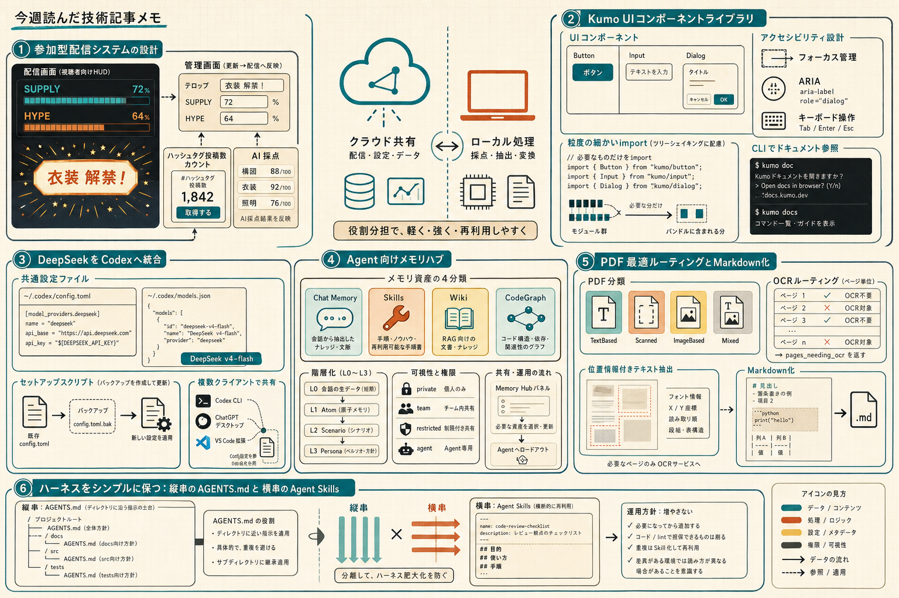

```toc
```



今週のまとめを書きました。各 clip は元記事へのリンク付きで、記事の主張と自分のコメントを中心にまとめています。

今回は、AIまわりの「作る」「つなぐ」「覚える」「絞る」が並んでいて、実装というより運用の形を考える記事が多かったです。非エンジニアがAIで配信システムを組む話と、AGENTS.md/Skillの整理の話が特に対照的でした。

## AIと配信システムを組み上げた話

**元記事**  
[宮本佳林『アイドルがAIと配信のシステムを全部作った話』](https://ameblo.jp/miyamotokarin-official/entry-12974432505.html)

**ひとこと**  
すごい。ドメイン知識あれば作れるんだよな。。

**読んで考えたこと**  
10時間配信のために、AIと一緒に配信システム一式を作った話でした。本人はプログラミング経験ゼロで、コードも書いていないけれど、配信画面のゲージ、管理画面、X投稿数の自動カウント、AI採点まで形にしています。

特に気になったのは、共有したい数字はクラウドに置いて、動画を扱う採点処理は手元PCに置く、という分け方でした。配信中に壊れても止めないために、手動変更や複数手段を用意していたのも実運用っぽいです。

AIで何でも作れる、というより「何を作りたいかを具体的に言えること」と「止めないための保険設計」が効いている記事でした。配信やイベント運用で似たことをやるなら、まずはクラウドとローカルの役割分担を決めるのが先だと思いました。

## Cloudflare の UI 基盤 Kumo

**元記事**  
[GitHub - cloudflare/kumo](https://github.com/cloudflare/kumo)

**ひとこと**  
取り入れてみよう

**読んで考えたこと**  
Kumo は Cloudflare のモダン Web アプリ向けコンポーネントライブラリでした。Base UI の上にあり、キーボード操作、フォーカス管理、ARIA 属性などをかなり吸収してくれる設計です。

README だけでも、`@cloudflare/kumo` の導入、粒度の細かい import による tree-shaking、Base UI primitives の再公開、CLI でのドキュメント参照まで揃っていました。実装を始める入口が分かりやすいです。

一方で、詳細な設計判断は README ではなく `AGENTS.md` や各コンポーネント文書を読む前提でした。Figma の token sync も任意で、`.env` 設定が要るので、導入は軽いけれど運用の深さはそこそこあります。

既存のデザインシステムと合わせて、アクセシビリティ対応の土台を省力化したいときに候補になりそうです。

## Codex で DeepSeek を使う設定

**元記事**  
[Integrate with Codex | DeepSeek API Docs](https://api-docs.deepseek.com/quick_start/agent_integrations/codex/)

**ひとこと**  
Deepseekがcodexで使える。トークン使い切ったら試したいけどすぐリセットされて機会がない

**読んで考えたこと**  
現時点では Codex 連携は deepseek-v4-flash のみ対応で、deepseek-v4-pro は 2026年8月上旬予定と書かれていました。Codex CLI、ChatGPT desktop app、VS Code 拡張で共通の設定ファイルを使えるのも実用的です。

セットアップは自動スクリプト推奨で、`~/.codex` のバックアップ、`models.json` の生成、`config.toml` の必要部分だけ更新、構文検証までやってくれます。既存の MCP servers や trust levels を壊しにくいのは安心材料でした。

「導入できるか」だけでなく「今どのモデルが使えるか」「設定を壊さず切り替えられるか」が大事だと分かる記事でした。トークンを使い切った後の試行先として、設定だけ先に置いておく価値はありそうです。

## チーム用メモリハブという発想

**元記事**  
[GitHub - TencentCloud/TencentDB-Agent-Memory](https://github.com/TencentCloud/TencentDB-Agent-Memory)

**ひとこと**  
気になる。導入ハードル低い？

**読んで考えたこと**  
AI Agent 向けのチーム用メモリハブで、会話・文書・コードから Chat Memory / Skill / Wiki / CodeGraph を作って共有する構成でした。`memory-core + memory-hub + proxy` の3サービスを `start-all.sh` で起動して、ローカルのパネルを開く導線が見えています。

面白かったのは、単なる会話ログ置き場ではなく、「何を残すか」「誰が使えるか」「次回はどう少なく正しく取るか」を分けて考えている点でした。L0〜L3 の階層化や、BM25 + ベクトル検索 + RRF の組み合わせも、再利用しやすさを意識した設計です。

共有は明示的で、private / team / restricted / agent の可視性を分けているのも運用しやすそうでした。チームで使うなら、知識を増やすよりも、まず誰に何を配るかを整理するほうが効くと感じました。

## OCR の前に判定する PDF 処理

**元記事**  
[GitHub - firecrawl/pdf-inspector](https://github.com/firecrawl/pdf-inspector)

**ひとこと**  
日本語もいけると強そう。

**読んで考えたこと**  
pdf-inspector は、PDF の分類・テキスト抽出・Markdown 変換を行う Rust 製ライブラリでした。TextBased / Scanned / ImageBased / Mixed を分け、ページ単位の OCR 振り分けまで返せるのが肝です。

README では、xref table と page tree を軽く見て、`Tj` / `TJ` と `Do` をサンプルして分類する方式が説明されていました。単一ドキュメントを一度だけ読んで分類と抽出で共有するので、無駄な再パースを避けています。

出力は Python / Node.js / browser WASM / Rust / CLI に対応していて、テキストベースの PDF ならローカルで速く Markdown 化できるのが強みです。逆に、壊れたフォントや画像ベースの PDF は OCR 前提なので、分類結果を見てルーティングする設計が必要だと思いました。

PDF を全部 OCR に回さず、まず読めるものを即処理する部品としてかなり実用的でした。

## AGENTS.md と Agent Skills を絞って保つ話

**元記事**  
[AIエージェントのハーネスをシンプルに保つ - 縦串のAGENTS.mdと横串のAgent Skills - An Epicurean](https://blog.song.mu/entry/agents-md-and-agent-skills)

**ひとこと**  
これ大事だわ

**読んで考えたこと**  
AGENTS.md は「縦串」、Agent Skills は「横串」と整理しているのが分かりやすかったです。ファイルツリーに沿った指示と、場所を問わず再利用する手順を分けて考えると、ハーネスの役割が見えやすくなります。

記事の軸は「増やす」ではなく「減らす」でした。AGENTS.md に入れるのはコードベースから読めないドメイン知識やポリシーに限り、コードや lint で担保できるものは削る。Skill も定型作業に絞り、決定論的な処理はスクリプトに寄せる、という話です。

Skill は便利でも、入れすぎるとコンテキスト消費、ライセンス確認、信頼性やセキュリティの負担が増えます。AI 向け設定は「一度作って終わり」ではなく、ソフトウェアとして定期的に見直すものだ、という指摘がかなり実務的でした。

## 今週の所感

今週は、AI に何を足すかより、何を残し、何を分け、何を削るかの話が多かったです。  
次に試すなら、まず AGENTS.md と Skill を増やす前に、今ある手順をスクリプト化して減らせないかを見直したいです。

---

## 参照したクリップ

- [宮本佳林『アイドルがAIと配信のシステムを全部作った話』](https://ameblo.jp/miyamotokarin-official/entry-12974432505.html)
- [GitHub - cloudflare/kumo: Cloudflare's component library for building modern web applications.](https://github.com/cloudflare/kumo)
- [Integrate with Codex | DeepSeek API Docs](https://api-docs.deepseek.com/quick_start/agent_integrations/codex/)
- [GitHub - TencentCloud/TencentDB-Agent-Memory: TencentDB Agent Memory is a team-level memory hub for AI Agents — turning conversations, docs, and code into four reusable memory assets (Chat Memory, Skill, LLM-Wiki, Code-Graph) that are governed, shared, and equipped across agents and frameworks.](https://github.com/TencentCloud/TencentDB-Agent-Memory)
- [GitHub - firecrawl/pdf-inspector: Fast Rust library for PDF inspection, classification, and text extraction. Intelligently detects scanned vs text-based PDFs to enable smart routing decisions.](https://github.com/firecrawl/pdf-inspector)
- [AIエージェントのハーネスをシンプルに保つ - 縦串のAGENTS.mdと横串のAgent Skills - An Epicurean](https://blog.song.mu/entry/agents-md-and-agent-skills)
