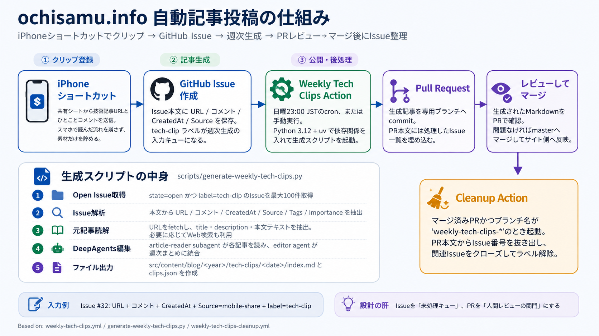

```toc
```

最近、このサイトに「今週読んだ技術記事メモ」という週次記事を追加しています。これは手で一から書いているわけではなく、スマホで読んだ記事を GitHub Issue に貯めておき、週末に GitHub Actions から生成スクリプトを動かして Pull Request にする、という流れにしています。

全体像はこんな感じです。



この記事では、今の自動投稿の仕組みを実装メモとして残しておきます。

## やりたかったこと

最初に解決したかったのは、「スマホで読んだ技術記事をあとでブログにする」が続かない問題でした。

PC の前で RSS やブックマークを整理しているときはまだいいのですが、実際には移動中や休憩中に iPhone で読むことが多いです。その場で長いメモを書く気にはならないし、あとで見返すために URL だけ保存しても、なぜ気になったのかを忘れます。

なので、入力時点では最低限にしました。

- 記事 URL
- ひとことコメント
- 任意のタグ
- 週次まとめに入れるかどうか

ここだけスマホから保存できれば、あとは自動化側で記事化できるようにしています。

## クリップ登録は GitHub Issue に寄せる

入り口は iPhone ショートカットです。共有シートから技術記事の URL とひとことコメントを送り、GitHub Issue を作ります。

Issue は `.github/ISSUE_TEMPLATE/blog-draft.yml` のテンプレートに合わせていて、`tech-clip` ラベルを付けます。このラベルが「まだ記事化していない入力キュー」になります。

ここで GitHub Issue を使っている理由は、単に GitHub Actions から扱いやすいからです。あとから検索できますし、ラベルで状態管理できます。専用の保存先を作るより、今のサイト運用と同じ場所に寄せたほうが軽く済みました。

Issue 本文には URL やコメントが Markdown として入るので、生成スクリプト側では見出しごとに値を抜き出しています。多少表記がぶれても拾えるように、`URL` / `リンク`、`Comment` / `コメント` / `メモ` など複数の見出し名を見ています。

## 週次生成は GitHub Actions で動かす

記事生成は `.github/workflows/weekly-tech-clips.yml` で動かしています。

実行タイミングは日曜 23:00 JST の cron と、必要なときに手で動かせる `workflow_dispatch` です。環境は GitHub Actions 上で Node.js 22 と Python 3.12 を用意し、`uv` で `requirements-weekly-tech-clips.txt` の依存を入れています。

実際に記事を作る中心は `scripts/generate-weekly-tech-clips.py` です。流れはだいたいこうです。

1. `tech-clip` ラベル付きの open Issue を最大 100 件取得する
2. Issue 本文から URL、コメント、作成日時、共有元、タグ、扱いを抽出する
3. URL を fetch して、title、description、本文テキストを取得する
4. DeepAgents で記事ごとの読解メモを作る
5. editor agent が週次まとめ記事に統合する
6. `src/content/blog/<year>/tech-clips/<date>/index.md` と `clips.json` を出力する

URL かコメントが取れない Issue はスキップします。入力が少し壊れているときに無理に記事へ混ぜるより、生成対象から外したほうがレビューしやすいと思ったためです。

## DeepAgents には役割を分けて読ませる

生成部分では、DeepAgents の subagent を使っています。

各クリップに対して `article-reader` subagent を 1 回呼び、元記事を読んだメモを作ります。この subagent には、まず `fetch_url(url)` を使うこと、ページ本文が足りないときだけ web search を使うこと、長い引用を避けることを指示しています。

そのあと editor agent が、複数の記事メモをまとめて週次記事にします。ここでは自分のブログらしい文体になるように、スクリプト内に `AUTHOR_STYLE_GUIDE` を置いています。

特に意識しているのは、元記事の要約だけにしないことです。保存時のひとことコメントを中心にして、「なぜ気になったのか」「実装や運用でどこが効きそうか」を書かせるようにしています。

## PR を人間レビューの関門にする

生成された Markdown は、そのまま master に入れず、専用ブランチに commit して Pull Request を作ります。

これはかなり大事なところです。AI が生成した記事は、文体が少しずれることもありますし、元記事の読み取りが浅いこともあります。公開前に人間が読む関門として PR を挟むことで、完全自動公開にはしていません。

PR 本文には、処理対象になった Issue の一覧も埋め込んでいます。

```markdown
<!-- weekly-tech-clips-issues
- #32: https://example.com/article (ok)
-->
```

このコメントブロックは、レビュー時の確認用でもあり、後処理用のデータでもあります。PR を見れば、どの Issue がどの記事生成に使われたかが分かります。

## マージ後に Issue を片付ける

記事 PR がマージされると、`.github/workflows/weekly-tech-clips-cleanup.yml` が動きます。

この workflow は、マージ済み PR かつブランチ名が `weekly-tech-clips-` で始まるときだけ動きます。PR 本文の `weekly-tech-clips-issues` ブロックから Issue 番号を抜き出し、処理済みとして片付けます。

具体的には、対象 Issue に対して次の処理をします。

- `tech-clip-posted` ラベルを作成する
- `tech-clip` ラベルを外す
- `tech-clip-posted` ラベルを付ける
- Issue を `completed` として close する

これで、open な `tech-clip` Issue だけが次回生成の対象として残ります。Issue を未処理キューとして使い、PR マージをもって処理済みにする、という単純な状態遷移です。

## 設計してよかったところ

一番よかったのは、入力と公開の間にレビューを残したことです。

スマホからの保存はできるだけ軽くして、生成は週次でまとめて実行し、公開前には PR で読む。この分け方にしたことで、「保存の手軽さ」と「公開前の確認」を両立できました。

もうひとつは、状態管理を GitHub のラベルと PR 本文だけで済ませているところです。DB や別サービスを持たずに、Issue が未処理キュー、`clips.json` が生成時の記録、PR が人間レビューの場所になります。小さい個人サイトの仕組みとしては、このくらいの素朴さがちょうどいいと思っています。

## 気をつけるところ

外部記事を fetch するので、本文が取れないページは普通にあります。そのため、スクリプトでは fetch status を `clips.json` に残し、必要に応じて web search も使えるようにしています。

また、AI 生成なので、完全に信用して公開する前提にはしていません。元記事の読み違い、表現の硬さ、コメントとの接続の弱さは起きます。PR レビューで直す前提にしたほうが、運用としては気が楽です。

コスト面では、`ARTICLE_TEXT_LIMIT` と `TOTAL_ARTICLE_TEXT_LIMIT` で渡す本文量を絞っています。記事本文を全部突っ込むとコンテキストも料金も膨らむので、週次で回すなら上限を持っておくのは必要でした。

## 今のまとめ

今の構成は、かなり小さな部品の組み合わせです。

iPhone ショートカットで保存し、GitHub Issue に積み、GitHub Actions で週次生成し、PR でレビューして、マージ後に Issue を閉じる。特別な管理画面はありませんが、個人ブログの自動投稿としては十分回っています。

ポイントは、全部を自動化しようとしないことでした。読む、気になった点を残す、週次で下書きにする、公開前に確認する。この境界を分けたことで、スマホで読んだ記事をブログに残す流れがかなり続けやすくなりました。
